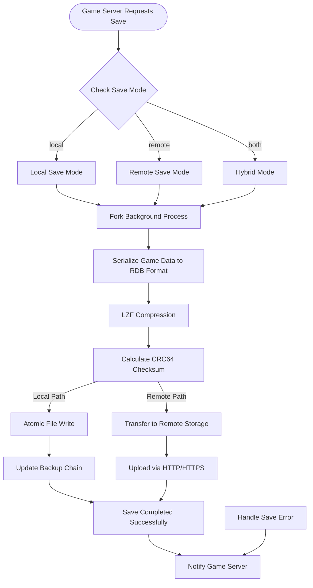
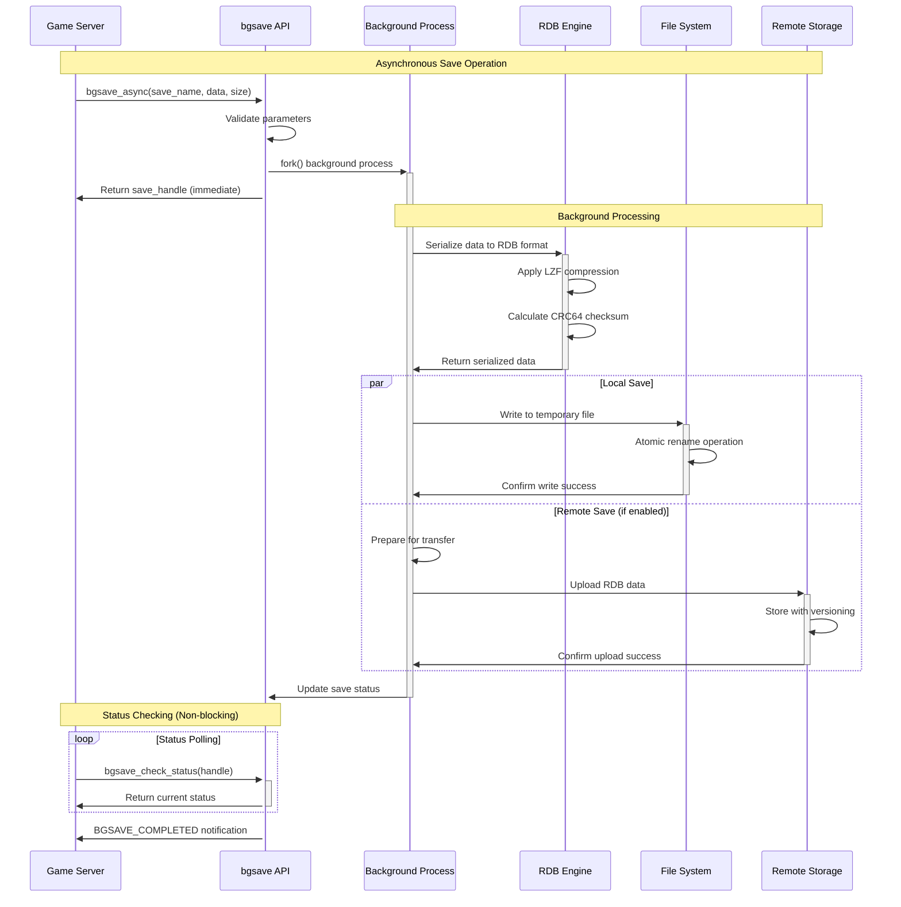

# Background Save Library

**[中文文档 (Chinese Documentation)](README_CN.md)**

[](https://github.com/your-repo/background-save-plugin)
[](LICENSE)
[](https://github.com/your-repo/background-save-plugin/releases)

A high-performance, lightweight C library for background data persistence, inspired by Redis's RDB save mechanism. This library provides efficient, non-blocking data serialization and storage capabilities for game servers.

- New to Background Save Plugin? Start with [What is Background Save Plugin](#what-is-background-save-plugin) and [Getting Started](#getting-started)
- Ready to build from source? Jump to [Build from Source](#build-from-source)
- Want to contribute? See the [Code contributions](#code-contributions) section
- Looking for detailed documentation? Navigate to [Documentation](#documentation)

## Table of contents

- [Background Save Library](#background-save-library)
  - [Table of contents](#table-of-contents)
  - [What is Background Save Plugin?](#what-is-background-save-plugin)
    - [Key features](#key-features)
  - [Why choose Background Save Plugin?](#why-choose-background-save-plugin)
  - [Architecture Overview](#architecture-overview)
    - [System Architecture](#system-architecture)
    - [Data Flow Architecture](#data-flow-architecture)
    - [Background Save Process Flow](#background-save-process-flow)
    - [Save Operation Sequence Diagram](#save-operation-sequence-diagram)
  - [Getting started](#getting-started)
    - [Quick installation](#quick-installation)
    - [Basic usage](#basic-usage)
    - [Configuration](#configuration)
  - [Core Libraries](#core-libraries)
    - [libbgsave](#libbgsave)
    - [libremotebgsave](#libremotebgsave)
  - [API Reference](#api-reference)
    - [Data Types](#data-types)
    - [Function Reference](#function-reference)
  - [Build from source](#build-from-source)
    - [Build on Windows](#build-on-windows)
    - [Build on Linux](#build-on-linux)
    - [Build on macOS](#build-on-macos)
    - [Build flags and options](#build-flags-and-options)
  - [Testing](#testing)
  - [Performance](#performance)
  - [Documentation](#documentation)
  - [Code contributions](#code-contributions)
  - [License](#license)

## What is Background Save Plugin?

Background Save Plugin is a high-performance, Redis-inspired persistence solution designed specifically for game servers. It leverages Redis's proven RDB (Redis Database) serialization format and background save mechanisms to provide efficient, non-blocking data storage capabilities.

### Key features

The plugin excels in various game server scenarios:

- **Non-blocking Persistence:** Utilizes fork-based background saving to avoid blocking the main game thread during save operations.
- **Efficient Serialization:** Implements Redis RDB format with LZF compression for optimal storage efficiency.
- **Local and Remote Storage:** Supports both local file storage and remote distributed storage solutions.
- **Data Integrity:** Includes CRC64 checksums and atomic write operations to ensure data consistency.
- **High Performance:** Optimized for low-latency operations with minimal memory overhead.
- **Scalability:** Designed to handle large-scale game server deployments with thousands of concurrent players.
- **Cross-platform:** Works seamlessly on Windows, Linux, and macOS environments.

## Why choose Background Save Plugin?

Background Save Plugin is designed for game developers who need reliable, high-performance persistence solutions:

- **Performance:** Achieves sub-millisecond save initiation times and minimal impact on game server performance through asynchronous operations.
- **Reliability:** Built on Redis's battle-tested RDB format, ensuring data durability and consistency across server restarts.
- **Flexibility:** Modular architecture allows integration with existing game server frameworks without major refactoring.
- **Scalability:** Handles both small indie games and large-scale MMO deployments with configurable performance parameters.
- **Developer-friendly:** Simple C API with comprehensive documentation and examples for rapid integration.

## Architecture Overview

The Background Save Plugin consists of two main components:

### System Architecture

```mermaid
graph TB
    subgraph "Game Server"
        GS[Game Server Process]
        GT[Game Thread]
        ST[Save Thread]
    end

    subgraph "libbgsave (Local Storage)"
        API[bgsave API]
        RDB[RDB Engine]
        FM[File Manager]
        COMP[LZF Compressor]
        CRC[CRC64 Checksum]
    end

    subgraph "libremotebgsave (Remote Storage)"
        RAPI[Remote API]
        NET[Network Layer]
        HTTP[HTTP/HTTPS Client]
        SYNC[Data Sync Engine]
        RETRY[Retry Manager]
    end

    subgraph "Storage Backends"
        LFS[Local File System]
        CLOUD[Cloud Storage]
        BACKUP[Backup Storage]
    end

    GS --> API
    API --> RDB
    RDB --> COMP
    COMP --> CRC
    CRC --> FM
    FM --> LFS

    GS --> RAPI
    RAPI --> HTTP
    HTTP --> NET
    NET --> RETRY
    RETRY --> SYNC
    SYNC --> CLOUD
    SYNC --> BACKUP

    GT -.->|fork()| ST
    ST --> API
    ST --> RAPI
```

### Data Flow Architecture

```
┌─────────────────────┐    ┌──────────────────────┐
│     libbgsave       │    │  libremotebgsave     │
│  (Local Storage)    │    │  (Remote Storage)    │
│                     │    │                      │
│ ┌─────────────────┐ │    │ ┌──────────────────┐ │
│ │   RDB Engine    │ │    │ │  Network Layer   │ │
│ │   - Serialize   │ │    │ │  - HTTP/HTTPS    │ │
│ │   - Compress    │ │    │ │  - Transfer      │ │
│ │   - Checksum    │ │    │ │  - Retry Logic   │ │
│ └─────────────────┘ │    │ └──────────────────┘ │
│                     │    │                      │
│ ┌─────────────────┐ │    │ ┌──────────────────┐ │
│ │  File Manager   │ │    │ │  Data Sync       │ │
│ │  - Atomic Ops   │ │    │ │  - Consistency   │ │
│ │  - Backup       │ │    │ │  - Versioning    │ │
│ └─────────────────┘ │    │ └──────────────────┘ │
└─────────────────────┘    └──────────────────────┘
```

### Background Save Process Flow



### Save Operation Sequence Diagram



## Getting started

### Quick installation

**Using pre-built binaries:**
```bash
# Download latest release
wget https://github.com/your-repo/background-save-plugin/releases/latest/download/bgsave-plugin-windows.zip
unzip bgsave-plugin-windows.zip
```

**Using package manager (future):**
```bash
# Coming soon
vcpkg install background-save-plugin
```

### Basic usage

```c
#include "bgsave.h"
#include "remotebgsave.h"

int main() {
    // Initialize local background save
    bgsave_config_t config = {
        .data_dir = "./game_saves",
        .compression = BGSAVE_COMPRESS_LZF,
        .checksum = true
    };

    if (bgsave_init(&config) != BGSAVE_OK) {
        fprintf(stderr, "Failed to initialize bgsave\n");
        return -1;
    }

    // Save game data
    game_data_t player_data = {
        .player_id = 12345,
        .level = 50,
        .experience = 125000
    };

    bgsave_handle_t save_handle;
    if (bgsave_async("player_12345", &player_data, sizeof(player_data), &save_handle) == BGSAVE_OK) {
        printf("Save operation initiated successfully\n");
    }

    // Check save completion (non-blocking)
    bgsave_status_t status = bgsave_check_status(save_handle);
    if (status == BGSAVE_COMPLETED) {
        printf("Save operation completed\n");
    }

    bgsave_cleanup();
    return 0;
}
```

### Configuration

Create a configuration file `bgsave.conf`:

```ini
# Background Save Plugin Configuration

[local]
data_dir = ./game_saves
compression = lzf
checksum = true
backup_count = 3
save_interval = 300  # seconds

[remote]
enabled = true
endpoint = https://your-game-cloud.com/api/saves
timeout = 30
retry_count = 3
format = rdb
```

## Core Libraries

### libbgsave

The local storage library provides efficient file-based persistence:

**Core Functions:**
- `bgsave_init()` - Initialize the background save system
- `bgsave_async()` - Start asynchronous save operation
- `bgsave_sync()` - Perform synchronous save operation
- `bgsave_load()` - Load saved data
- `bgsave_list()` - List available saves
- `bgsave_delete()` - Delete save files

**Features:**
- Fork-based background saving
- LZF compression
- Atomic file operations
- Automatic backup rotation
- CRC64 integrity checking

### libremotebgsave

The remote storage library handles distributed save operations:

**Core Functions:**
- `remote_bgsave_init()` - Initialize remote save system
- `remote_bgsave_upload()` - Upload save data to remote storage
- `remote_bgsave_download()` - Download save data from remote storage
- `remote_bgsave_sync()` - Synchronize local and remote saves
- `remote_bgsave_list_remote()` - List remote save files

**Features:**
- HTTP/HTTPS protocol support
- Automatic retry with exponential backoff
- Bandwidth throttling
- Conflict resolution
- Data integrity verification

## API Reference

### Data Types

```c
typedef enum {
    BGSAVE_OK = 0,
    BGSAVE_ERROR = -1,
    BGSAVE_PENDING = 1,
    BGSAVE_COMPLETED = 2,
    BGSAVE_FAILED = -2
} bgsave_result_t;

typedef struct {
    char* data_dir;
    bgsave_compression_t compression;
    bool checksum;
    int backup_count;
    int save_interval;
} bgsave_config_t;

typedef struct {
    uint64_t save_id;
    time_t timestamp;
    size_t data_size;
    char filename[256];
} bgsave_info_t;
```

### Function Reference

**Local Storage API:**

```c
// Initialize background save system
bgsave_result_t bgsave_init(const bgsave_config_t* config);

// Asynchronous save operation
bgsave_result_t bgsave_async(const char* save_name,
                            const void* data,
                            size_t size,
                            bgsave_handle_t* handle);

// Synchronous save operation
bgsave_result_t bgsave_sync(const char* save_name,
                           const void* data,
                           size_t size);

// Load saved data
bgsave_result_t bgsave_load(const char* save_name,
                           void** data,
                           size_t* size);

// Check operation status
bgsave_status_t bgsave_check_status(bgsave_handle_t handle);

// Cleanup resources
void bgsave_cleanup();
```

**Remote Storage API:**

```c
// Initialize remote save system
remote_bgsave_result_t remote_bgsave_init(const remote_config_t* config);

// Upload save data
remote_bgsave_result_t remote_bgsave_upload(const char* save_name,
                                           const void* data,
                                           size_t size,
                                           remote_handle_t* handle);

// Download save data
remote_bgsave_result_t remote_bgsave_download(const char* save_name,
                                             void** data,
                                             size_t* size);

// Synchronize saves
remote_bgsave_result_t remote_bgsave_sync(sync_mode_t mode);

// Cleanup remote resources
void remote_bgsave_cleanup();
```

## Build from source

### Build on Windows

**Prerequisites:**
- Visual Studio 2019 or later
- CMake 3.15+
- vcpkg (recommended)

**Build steps:**

1. Clone the repository:
   ```cmd
   git clone https://github.com/your-repo/background-save-plugin.git
   cd background-save-plugin
   ```

2. Configure with CMake:
   ```cmd
   mkdir build
   cd build
   cmake .. -DCMAKE_TOOLCHAIN_FILE=C:/vcpkg/scripts/buildsystems/vcpkg.cmake
   ```

3. Build the project:
   ```cmd
   cmake --build . --config Release
   ```

4. Run tests:
   ```cmd
   ctest -C Release
   ```

### Build on Linux

**Prerequisites:**
- GCC 9+ or Clang 10+
- CMake 3.15+
- Make

**Build steps:**

1. Install dependencies:
   ```bash
   # Ubuntu/Debian
   sudo apt-get update
   sudo apt-get install -y build-essential cmake libssl-dev zlib1g-dev

   # CentOS/RHEL
   sudo yum groupinstall "Development Tools"
   sudo yum install cmake openssl-devel zlib-devel
   ```

2. Clone and build:
   ```bash
   git clone https://github.com/your-repo/background-save-plugin.git
   cd background-save-plugin
   mkdir build && cd build
   cmake .. -DCMAKE_BUILD_TYPE=Release
   make -j$(nproc)
   ```

3. Install (optional):
   ```bash
   sudo make install
   ```

### Build on macOS

**Prerequisites:**
- Xcode Command Line Tools
- CMake (via Homebrew)

**Build steps:**

1. Install dependencies:
   ```bash
   xcode-select --install
   brew install cmake openssl zlib
   ```

2. Build:
   ```bash
   git clone https://github.com/your-repo/background-save-plugin.git
   cd background-save-plugin
   mkdir build && cd build
   cmake .. -DCMAKE_BUILD_TYPE=Release
   make -j$(sysctl -n hw.ncpu)
   ```

### Build flags and options

**CMake Options:**

```bash
# Enable/disable features
cmake .. -DBGSAVE_ENABLE_COMPRESSION=ON    # LZF compression support
cmake .. -DBGSAVE_ENABLE_REMOTE=ON         # Remote storage support
cmake .. -DBGSAVE_ENABLE_TESTS=ON          # Build test suite
cmake .. -DBGSAVE_ENABLE_EXAMPLES=ON       # Build examples

# Performance options
cmake .. -DBGSAVE_OPTIMIZE_SIZE=OFF        # Optimize for speed vs size
cmake .. -DBGSAVE_USE_JEMALLOC=ON          # Use jemalloc allocator

# Debug options
cmake .. -DCMAKE_BUILD_TYPE=Debug          # Debug build
cmake .. -DBGSAVE_ENABLE_LOGGING=ON        # Enable debug logging
cmake .. -DBGSAVE_ENABLE_PROFILING=ON      # Enable profiling
```

## Testing

Run the comprehensive test suite:

```bash
# Build and run all tests
cd build
make test

# Run specific test categories
ctest -L "unit"        # Unit tests only
ctest -L "integration" # Integration tests only
ctest -L "performance" # Performance tests only

# Run tests with verbose output
ctest --verbose

# Run tests with memory checking (requires valgrind)
ctest -D ExperimentalMemCheck
```

**Test Categories:**
- **Unit Tests:** Individual function and module testing
- **Integration Tests:** End-to-end workflow testing
- **Performance Tests:** Throughput and latency benchmarks
- **Stress Tests:** High-load and edge case testing

## Performance

**Performance is based on Redis RDB format characteristics:**

The plugin leverages Redis's proven RDB serialization performance. Actual performance will vary based on:

- **Hardware specifications** (CPU, RAM, storage type)
- **Data size and complexity** (simple structures vs. complex nested data)
- **Compression settings** (LZF compression trade-offs)
- **Network conditions** (for remote saves)
- **System load** (concurrent operations)

**Expected Performance Characteristics:**
- ✅ **Non-blocking saves** - Main thread continues during background save
- ✅ **Memory efficient** - Fork-based copy-on-write mechanism
- ✅ **Fast serialization** - Redis RDB format is highly optimized
- ✅ **Scalable** - Performance scales with hardware capabilities

**Benchmark Your Setup:**
```bash
# Run included benchmark suite
cd build
./benchmark --local-save --data-size=1KB --iterations=10000
./benchmark --remote-save --endpoint=your-server --iterations=1000

# Custom performance testing
./benchmark --config=your-config.ini --report=detailed
```

**Optimization Tips:**
- Use appropriate compression levels for your data
- Batch small saves together when possible
- Configure backup rotation based on disk space
- Monitor memory usage in high-frequency save scenarios
- Test with your actual game data patterns

## Documentation

- [API Documentation](docs/api.md) - Complete API reference
- [Integration Guide](docs/integration.md) - Step-by-step integration
- [Configuration Reference](docs/configuration.md) - All configuration options
- [Performance Tuning](docs/performance.md) - Optimization guidelines
- [Troubleshooting](docs/troubleshooting.md) - Common issues and solutions
- [Examples](examples/) - Sample code and use cases

## Code contributions

We welcome contributions to the Background Save Plugin project! Please follow these guidelines:

**Getting Started:**
1. Fork the repository
2. Create a feature branch (`git checkout -b feature/amazing-feature`)
3. Make your changes
4. Add tests for new functionality
5. Ensure all tests pass
6. Submit a pull request

**Coding Standards:**
- Follow C99 standard
- Use consistent indentation (4 spaces)
- Add comprehensive comments for public APIs
- Include unit tests for new features
- Update documentation as needed

**Before submitting:**
- Run `make format` to format code
- Run `make lint` to check code style
- Ensure all tests pass with `make test`
- Update CHANGELOG.md with your changes

For more details, see [CONTRIBUTING.md](CONTRIBUTING.md).

## License

This project is licensed under the MIT License - see the [LICENSE](LICENSE) file for details.

**Third-party components:**
- LZF compression library (BSD-2-Clause) - *Optional, can be disabled*
- CRC64 checksum implementation (Public Domain)
- Standard C library only - **No external dependencies required**

**What we DON'T include:**
- ❌ No Lua scripting engine (unlike Redis)
- ❌ No network server functionality
- ❌ No Redis protocol implementation
- ❌ Pure C99 implementation with minimal dependencies

---

**Maintained by:** 钟芳道 (DJD) [zhongfangdao888@gmail.com](mailto:zhongfangdao888@gmail.com)
**Project Homepage:** [https://github.com/your-repo/background-save-plugin](https://github.com/your-repo/background-save-plugin)
**Issue Tracker:** [https://github.com/your-repo/background-save-plugin/issues](https://github.com/your-repo/background-save-plugin/issues)